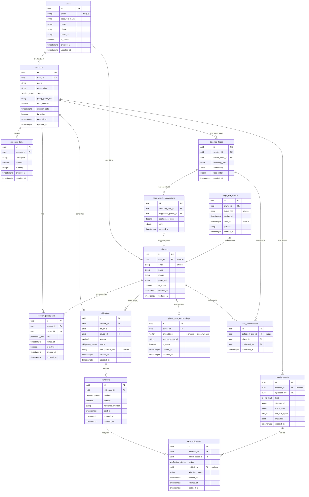

# Database Schema Contract

This document defines the PostgreSQL database schema for the **Paid** backend — a bill-splitting application with face detection-assisted attendee identification and equal expense splitting.

> [!NOTE]
> This is the source-of-truth for database structure. All tables use UUID primary keys and `timestamptz` for timestamps.

---

## Entity Relationship Diagram



---

## Enums / Status Definitions

### Session Status

| Value | Description |
|-------|-------------|
| `DRAFT` | Session created, not yet ready for participants |
| `PROCESSING_FACES` | Group photo uploaded, face detection in progress |
| `READY_TO_SPLIT` | Faces processed, awaiting host confirmation and split |
| `SPLIT_CONFIRMED` | Split confirmed, obligations generated |
| `CLOSED` | All payments verified, session complete |

### Obligation Status

| Value | Description |
|-------|-------------|
| `PENDING` | Obligation created, awaiting payment |
| `MARKED_PAID` | Payer marked as paid, awaiting verification |
| `VERIFIED` | Host verified payment |
| `REJECTED` | Payment proof rejected by host |

### Media Kind

| Value | Description |
|-------|-------------|
| `GROUP_PHOTO` | Session group photo for face detection |
| `PAYMENT_PROOF` | Screenshot/photo of payment receipt |
| `PROFILE_PHOTO` | User or player profile photo |

### Participant Role

| Value | Description |
|-------|-------------|
| `HOST` | Session creator, manages splits and verifies payments |
| `PLAYER` | Regular participant who owes host |

### Payment Method

| Value | Description |
|-------|-------------|
| `CASH` | Cash payment |
| `TRANSFER` | Bank transfer |
| `EWALLET` | E-wallet (GoPay, OVO, DANA, etc.) |
| `OTHER` | Other payment method |

### Verification Status

| Value | Description |
|-------|-------------|
| `PENDING` | Proof uploaded, awaiting review |
| `APPROVED` | Host approved the payment proof |
| `REJECTED` | Host rejected the payment proof |

---

## Table Contracts

### `users`

**Purpose:** Registered app users who can host sessions. Hosts manage events, confirm face mappings, and verify payments.

| Column | Type | Nullable | Default | Description |
|--------|------|----------|---------|-------------|
| `id` | `uuid` | NO | `gen_random_uuid()` | Primary key |
| `email` | `varchar(255)` | NO | - | Unique email address |
| `password_hash` | `varchar(255)` | YES | - | Bcrypt hash (null for OAuth) |
| `name` | `varchar(255)` | NO | - | Display name |
| `phone` | `varchar(50)` | YES | - | Phone number |
| `photo_url` | `text` | YES | - | Profile photo URL |
| `bank_name` | `varchar(100)` | YES | - | Bank name for payment transfers |
| `bank_account_number` | `varchar(50)` | YES | - | Bank account number |
| `bank_account_name` | `varchar(255)` | YES | - | Bank account holder name |
| `is_active` | `boolean` | NO | `true` | Soft delete flag |
| `deleted_at` | `timestamptz` | YES | - | Soft delete timestamp |
| `created_at` | `timestamptz` | NO | `now()` | Record creation time |
| `updated_at` | `timestamptz` | NO | `now()` | Last update time |

**Primary Key:** `id`

**Unique Constraints:**
- `email` — Each email can only have one account

**Indexes:**
- `idx_users_email` on `email` — Fast login lookups
- `idx_users_is_active` on `is_active` — Active user filtering

---

### `players`

**Purpose:** Individuals who participate in bill splits. May or may not be registered users. Players can be created during session setup or automatically via face detection.

| Column | Type | Nullable | Default | Description |
|--------|------|----------|---------|-------------|
| `id` | `uuid` | NO | `gen_random_uuid()` | Primary key |
| `user_id` | `uuid` | YES | - | Links to registered user (if any) |
| `email` | `varchar(255)` | YES | - | Contact email |
| `name` | `varchar(255)` | NO | - | Display name |
| `phone` | `varchar(50)` | YES | - | Phone number for notifications |
| `photo_url` | `text` | YES | - | Profile photo URL |
| `is_active` | `boolean` | NO | `true` | Soft delete flag |
| `deleted_at` | `timestamptz` | YES | - | Soft delete timestamp |
| `created_at` | `timestamptz` | NO | `now()` | Record creation time |
| `updated_at` | `timestamptz` | NO | `now()` | Last update time |

**Primary Key:** `id`

**Foreign Keys:**
- `user_id` → `users.id` ON DELETE SET NULL

**Unique Constraints:**
- `email` — When not null, must be unique

**Indexes:**
- `idx_players_user_id` on `user_id` — Link user to their player record
- `idx_players_email` on `email` — Player lookup by email

---

### `player_face_embeddings`

**Purpose:** Stores enrolled face embeddings for known players. Used to match detected faces in group photos to existing players.

| Column | Type | Nullable | Default | Description |
|--------|------|----------|---------|-------------|
| `id` | `uuid` | NO | `gen_random_uuid()` | Primary key |
| `player_id` | `uuid` | NO | - | Owner of this embedding |
| `embedding` | `vector(512)` | NO | - | Face embedding (pgvector); fallback `bytea` |
| `source_photo_url` | `text` | YES | - | Original photo used for enrollment |
| `is_active` | `boolean` | NO | `true` | Whether this embedding is actively used |
| `created_at` | `timestamptz` | NO | `now()` | Record creation time |
| `updated_at` | `timestamptz` | NO | `now()` | Last update time |

**Primary Key:** `id`

**Foreign Keys:**
- `player_id` → `players.id` ON DELETE CASCADE

**Indexes:**
- `idx_player_face_embeddings_player_id` on `player_id` — Fast lookup by player
- Vector similarity index (HNSW or IVFFlat) on `embedding` — Fast nearest-neighbor search

> [!IMPORTANT]
> **Privacy/Retention:** Face embeddings are sensitive biometric data. Implement data retention policies to delete embeddings after a reasonable period (e.g., 90 days of inactivity) and ensure GDPR/local privacy compliance.

---

### `sessions`

**Purpose:** A bill-splitting event/activity (e.g., sports court rental, dinner). The host creates sessions, adds participants, uploads group photos, and manages expense splits.

| Column | Type | Nullable | Default | Description |
|--------|------|----------|---------|-------------|
| `id` | `uuid` | NO | `gen_random_uuid()` | Primary key |
| `host_id` | `uuid` | NO | - | User who created and manages this session |
| `name` | `varchar(255)` | NO | - | Session name |
| `description` | `text` | YES | - | Optional description |
| `status` | `session_status` | NO | `'DRAFT'` | Current session state |
| `group_photo_url` | `text` | YES | - | URL of uploaded group photo |
| `total_amount` | `decimal(12,2)` | YES | - | Total expense amount |
| `session_date` | `timestamptz` | YES | - | When the activity occurred |
| `is_active` | `boolean` | NO | `true` | Soft delete flag |
| `deleted_at` | `timestamptz` | YES | - | Soft delete timestamp |
| `created_at` | `timestamptz` | NO | `now()` | Record creation time |
| `updated_at` | `timestamptz` | NO | `now()` | Last update time |

**Primary Key:** `id`

**Foreign Keys:**
- `host_id` → `users.id` ON DELETE CASCADE

**Indexes:**
- `idx_sessions_host_id` on `host_id` — List sessions by host
- `idx_sessions_status` on `status` — Filter by session status
- `idx_sessions_session_date` on `session_date` — Sort by date

**Check Constraints:**
- `total_amount >= 0` — Amount cannot be negative

---

### `session_participants`

**Purpose:** Junction table linking players to sessions. Tracks who participated and their role.

| Column | Type | Nullable | Default | Description |
|--------|------|----------|---------|-------------|
| `id` | `uuid` | NO | `gen_random_uuid()` | Primary key |
| `session_id` | `uuid` | NO | - | The session |
| `player_id` | `uuid` | NO | - | The participant |
| `role` | `participant_role` | NO | `'PLAYER'` | HOST or PLAYER |
| `joined_at` | `timestamptz` | NO | `now()` | When player was added |
| `is_active` | `boolean` | NO | `true` | Soft delete flag |
| `created_at` | `timestamptz` | NO | `now()` | Record creation time |
| `updated_at` | `timestamptz` | NO | `now()` | Last update time |

**Primary Key:** `id`

**Foreign Keys:**
- `session_id` → `sessions.id` ON DELETE CASCADE
- `player_id` → `players.id` ON DELETE CASCADE

**Unique Constraints:**
- `(session_id, player_id)` — Each player participates once per session

**Indexes:**
- `idx_session_participants_session_id` on `session_id` — List participants
- `idx_session_participants_player_id` on `player_id` — Player's sessions

---

### `expense_items`

**Purpose:** Individual expense line items within a session. Used to itemize costs before calculating the split.

| Column | Type | Nullable | Default | Description |
|--------|------|----------|---------|-------------|
| `id` | `uuid` | NO | `gen_random_uuid()` | Primary key |
| `session_id` | `uuid` | NO | - | Parent session |
| `description` | `varchar(255)` | NO | - | Item description |
| `amount` | `decimal(12,2)` | NO | - | Unit price |
| `quantity` | `integer` | NO | `1` | Number of units |
| `created_at` | `timestamptz` | NO | `now()` | Record creation time |
| `updated_at` | `timestamptz` | NO | `now()` | Last update time |

**Primary Key:** `id`

**Foreign Keys:**
- `session_id` → `sessions.id` ON DELETE CASCADE

**Indexes:**
- `idx_expense_items_session_id` on `session_id` — List items by session

**Check Constraints:**
- `amount >= 0` — Amount cannot be negative
- `quantity > 0` — Quantity must be positive

---

### `media_assets`

**Purpose:** Centralized storage for all uploaded files (group photos, payment proofs, profile photos). Stores metadata and references to actual file storage.

| Column | Type | Nullable | Default | Description |
|--------|------|----------|---------|-------------|
| `id` | `uuid` | NO | `gen_random_uuid()` | Primary key |
| `session_id` | `uuid` | YES | - | Associated session (if applicable) |
| `uploaded_by` | `uuid` | NO | - | User who uploaded |
| `kind` | `media_kind` | NO | - | Type of media |
| `storage_url` | `text` | NO | - | URL to file in storage |
| `mime_type` | `varchar(100)` | NO | - | File MIME type |
| `file_size_bytes` | `integer` | YES | - | File size in bytes |
| `metadata` | `jsonb` | YES | - | Additional metadata |
| `created_at` | `timestamptz` | NO | `now()` | Upload timestamp |

**Primary Key:** `id`

**Foreign Keys:**
- `session_id` → `sessions.id` ON DELETE SET NULL
- `uploaded_by` → `users.id` ON DELETE CASCADE

**Indexes:**
- `idx_media_assets_session_id` on `session_id` — Assets by session
- `idx_media_assets_kind` on `kind` — Filter by type

---

### `detected_faces`

**Purpose:** Faces detected in session group photos. Each detected face has a bounding box and embedding for matching.

| Column | Type | Nullable | Default | Description |
|--------|------|----------|---------|-------------|
| `id` | `uuid` | NO | `gen_random_uuid()` | Primary key |
| `session_id` | `uuid` | NO | - | Session this photo belongs to |
| `media_asset_id` | `uuid` | NO | - | The group photo |
| `bounding_box` | `jsonb` | NO | - | `{x, y, width, height}` |
| `embedding` | `vector(512)` | NO | - | Face embedding for matching |
| `face_index` | `integer` | NO | - | Order of face in photo |
| `created_at` | `timestamptz` | NO | `now()` | Detection timestamp |

**Primary Key:** `id`

**Foreign Keys:**
- `session_id` → `sessions.id` ON DELETE CASCADE
- `media_asset_id` → `media_assets.id` ON DELETE CASCADE

**Unique Constraints:**
- `(media_asset_id, face_index)` — Each face has unique index per photo

**Indexes:**
- `idx_detected_faces_session_id` on `session_id` — Faces by session
- Vector similarity index on `embedding` — Fast matching

> [!NOTE]
> Face detection runs asynchronously after group photo upload. Results are stored here.

---

### `face_match_suggestions`

**Purpose:** AI-generated suggestions matching detected faces to known players. Ranked by confidence score.

| Column | Type | Nullable | Default | Description |
|--------|------|----------|---------|-------------|
| `id` | `uuid` | NO | `gen_random_uuid()` | Primary key |
| `detected_face_id` | `uuid` | NO | - | The detected face |
| `suggested_player_id` | `uuid` | NO | - | Suggested player match |
| `confidence_score` | `decimal(5,4)` | NO | - | Match confidence (0-1.0000) |
| `rank` | `integer` | NO | - | Rank among suggestions |
| `created_at` | `timestamptz` | NO | `now()` | Suggestion timestamp |

**Primary Key:** `id`

**Foreign Keys:**
- `detected_face_id` → `detected_faces.id` ON DELETE CASCADE
- `suggested_player_id` → `players.id` ON DELETE CASCADE

**Unique Constraints:**
- `(detected_face_id, suggested_player_id)` — One suggestion per face-player pair

**Indexes:**
- `idx_face_match_suggestions_detected_face_id` on `detected_face_id` — Suggestions per face
- `idx_face_match_suggestions_rank` on `(detected_face_id, rank)` — Ordered suggestions

**Check Constraints:**
- `confidence_score >= 0 AND confidence_score <= 1` — Valid score range
- `rank > 0` — Positive rank

---

### `face_confirmations`

**Purpose:** Host-confirmed mappings from detected faces to players. Final source of truth for who is in the photo.

| Column | Type | Nullable | Default | Description |
|--------|------|----------|---------|-------------|
| `id` | `uuid` | NO | `gen_random_uuid()` | Primary key |
| `detected_face_id` | `uuid` | NO | - | The detected face |
| `player_id` | `uuid` | NO | - | Confirmed player identity |
| `confirmed_by` | `uuid` | NO | - | Host who confirmed |
| `confirmed_at` | `timestamptz` | NO | `now()` | Confirmation timestamp |

**Primary Key:** `id`

**Foreign Keys:**
- `detected_face_id` → `detected_faces.id` ON DELETE CASCADE
- `player_id` → `players.id` ON DELETE CASCADE
- `confirmed_by` → `users.id` ON DELETE CASCADE

**Unique Constraints:**
- `detected_face_id` — Each face confirmed exactly once

**Indexes:**
- `idx_face_confirmations_player_id` on `player_id` — Confirmations by player

---

### `obligations`

**Purpose:** Payment obligations generated after split confirmation. Each obligation represents an amount one player owes to the host (payee is always the host for now).

| Column | Type | Nullable | Default | Description |
|--------|------|----------|---------|-------------|
| `id` | `uuid` | NO | `gen_random_uuid()` | Primary key |
| `session_id` | `uuid` | NO | - | Source session |
| `payer_id` | `uuid` | NO | - | Player who owes |
| `payee_id` | `uuid` | NO | - | Host receiving payment |
| `amount` | `decimal(12,2)` | NO | - | Amount owed |
| `status` | `obligation_status` | NO | `'PENDING'` | Payment status |
| `idempotency_key` | `varchar(255)` | NO | - | Unique key for idempotent creation |
| `created_at` | `timestamptz` | NO | `now()` | Record creation time |
| `updated_at` | `timestamptz` | NO | `now()` | Last update time |

**Primary Key:** `id`

**Foreign Keys:**
- `session_id` → `sessions.id` ON DELETE CASCADE
- `payer_id` → `players.id` ON DELETE CASCADE
- `payee_id` → `players.id` ON DELETE CASCADE

**Unique Constraints:**
- `idempotency_key` — Prevents duplicate obligation creation
- `(session_id, payer_id)` — One obligation per payer per session

**Indexes:**
- `idx_obligations_session_id` on `session_id` — Obligations by session
- `idx_obligations_payer_id` on `payer_id` — What player owes
- `idx_obligations_status` on `status` — Filter by status

**Check Constraints:**
- `amount > 0` — Obligation amount must be positive

---

### `payments`

**Purpose:** Payment records when a player marks an obligation as paid. Tracks method and reference.

| Column | Type | Nullable | Default | Description |
|--------|------|----------|---------|-------------|
| `id` | `uuid` | NO | `gen_random_uuid()` | Primary key |
| `obligation_id` | `uuid` | NO | - | The obligation being paid |
| `method` | `payment_method` | NO | - | How payment was made |
| `amount` | `decimal(12,2)` | NO | - | Amount paid |
| `reference_number` | `varchar(255)` | YES | - | Transaction reference |
| `paid_at` | `timestamptz` | NO | `now()` | When player marked as paid |
| `created_at` | `timestamptz` | NO | `now()` | Record creation time |
| `updated_at` | `timestamptz` | NO | `now()` | Last update time |

**Primary Key:** `id`

**Foreign Keys:**
- `obligation_id` → `obligations.id` ON DELETE CASCADE

**Indexes:**
- `idx_payments_obligation_id` on `obligation_id` — Payments per obligation

**Check Constraints:**
- `amount > 0` — Payment amount must be positive

---

### `payment_proofs`

**Purpose:** Uploaded proof of payment (receipts, screenshots) and verification status by host.

| Column | Type | Nullable | Default | Description |
|--------|------|----------|---------|-------------|
| `id` | `uuid` | NO | `gen_random_uuid()` | Primary key |
| `payment_id` | `uuid` | NO | - | The payment record |
| `media_asset_id` | `uuid` | NO | - | Uploaded proof image |
| `status` | `verification_status` | NO | `'PENDING'` | Verification state |
| `verified_by` | `uuid` | YES | - | Host who verified |
| `rejection_reason` | `text` | YES | - | Reason if rejected |
| `verified_at` | `timestamptz` | YES | - | Verification timestamp |
| `created_at` | `timestamptz` | NO | `now()` | Upload timestamp |
| `updated_at` | `timestamptz` | NO | `now()` | Last update time |

**Primary Key:** `id`

**Foreign Keys:**
- `payment_id` → `payments.id` ON DELETE CASCADE
- `media_asset_id` → `media_assets.id` ON DELETE CASCADE
- `verified_by` → `users.id` ON DELETE SET NULL

**Indexes:**
- `idx_payment_proofs_payment_id` on `payment_id` — Proofs per payment
- `idx_payment_proofs_status` on `status` — Filter by verification status

---

### `magic_link_tokens`

**Purpose:** Short-lived tokens for outside-app access. Allows participants to view/update payments without full authentication.

| Column | Type | Nullable | Default | Description |
|--------|------|----------|---------|-------------|
| `id` | `uuid` | NO | `gen_random_uuid()` | Primary key |
| `player_id` | `uuid` | NO | - | Player this token authenticates |
| `token_hash` | `varchar(255)` | NO | - | SHA-256 hash of token |
| `expires_at` | `timestamptz` | NO | - | Token expiration time |
| `used_at` | `timestamptz` | YES | - | When token was used (single-use) |
| `purpose` | `varchar(50)` | NO | - | Token purpose (e.g., 'payment') |
| `created_at` | `timestamptz` | NO | `now()` | Token creation time |

**Primary Key:** `id`

**Foreign Keys:**
- `player_id` → `players.id` ON DELETE CASCADE

**Unique Constraints:**
- `token_hash` — Each token hash is unique

**Indexes:**
- `idx_magic_link_tokens_token_hash` on `token_hash` — Fast token lookup
- `idx_magic_link_tokens_player_id` on `player_id` — Tokens by player
- `idx_magic_link_tokens_expires_at` on `expires_at` — Cleanup expired

> [!CAUTION]
> **Security Notes:**
> - Store only the hash, never the raw token
> - Set short expiration (e.g., 24 hours)
> - Mark `used_at` immediately on use to prevent replay
> - Clean up expired tokens regularly

---

## Business Rules

### Equal Split Calculation

The current system supports **equal split only**:

```
per_person_amount = total_amount / participant_count
```

**Rounding Rule (Banker's Rounding):**
- Round to 2 decimal places using round-half-to-even (banker's rounding)
- Any remainder from rounding is absorbed by the host
- Example: `100.00 / 3 = 33.33` per person, host receives `99.99` (absorbs `0.01`)

### Idempotency Strategy for Obligations

Obligations are generated idempotently using a composite key:

```
idempotency_key = session_id + ":" + payer_id
```

**Rules:**
- Calling the split generation endpoint multiple times produces the same obligations
- If an obligation with the same `idempotency_key` exists, the operation is idempotent (no duplicate created)
- This prevents double-charging participants if the split API is called multiple times

### Magic Link Token Rules

1. **Expiry:** Tokens expire after 24 hours by default
2. **Single Use:** Once `used_at` is set, the token cannot be reused
3. **Replay Prevention:** Check both `expires_at` and `used_at IS NULL` before accepting
4. **Hash Storage:** Only store SHA-256 hash; compare hashes on verification
5. **Purpose Binding:** Tokens are scoped to a specific purpose (e.g., "payment", "view")

### Session Status Flow

```
DRAFT → PROCESSING_FACES → READY_TO_SPLIT → SPLIT_CONFIRMED → CLOSED
```

| Transition | Trigger |
|------------|---------|
| `DRAFT → PROCESSING_FACES` | Host uploads group photo |
| `PROCESSING_FACES → READY_TO_SPLIT` | Face detection completes |
| `READY_TO_SPLIT → SPLIT_CONFIRMED` | Host confirms face mappings and triggers split |
| `SPLIT_CONFIRMED → CLOSED` | All obligations verified |

---

## Appendix: DDL Skeleton

```sql
-- Extensions
CREATE EXTENSION IF NOT EXISTS "uuid-ossp";
CREATE EXTENSION IF NOT EXISTS "pgvector";  -- For face embeddings

-- Enums
CREATE TYPE session_status AS ENUM (
    'DRAFT', 'PROCESSING_FACES', 'READY_TO_SPLIT', 'SPLIT_CONFIRMED', 'CLOSED'
);

CREATE TYPE obligation_status AS ENUM (
    'PENDING', 'MARKED_PAID', 'VERIFIED', 'REJECTED'
);

CREATE TYPE media_kind AS ENUM (
    'GROUP_PHOTO', 'PAYMENT_PROOF', 'PROFILE_PHOTO'
);

CREATE TYPE participant_role AS ENUM (
    'HOST', 'PLAYER'
);

CREATE TYPE payment_method AS ENUM (
    'CASH', 'TRANSFER', 'EWALLET', 'OTHER'
);

CREATE TYPE verification_status AS ENUM (
    'PENDING', 'APPROVED', 'REJECTED'
);

-- Users
CREATE TABLE users (
    id UUID PRIMARY KEY DEFAULT gen_random_uuid(),
    email VARCHAR(255) NOT NULL UNIQUE,
    password_hash VARCHAR(255),
    name VARCHAR(255) NOT NULL,
    phone VARCHAR(50),
    photo_url TEXT,
    is_active BOOLEAN NOT NULL DEFAULT true,
    deleted_at TIMESTAMPTZ,
    created_at TIMESTAMPTZ NOT NULL DEFAULT now(),
    updated_at TIMESTAMPTZ NOT NULL DEFAULT now()
);

-- Players
CREATE TABLE players (
    id UUID PRIMARY KEY DEFAULT gen_random_uuid(),
    user_id UUID REFERENCES users(id) ON DELETE SET NULL,
    email VARCHAR(255) UNIQUE,
    name VARCHAR(255) NOT NULL,
    phone VARCHAR(50),
    photo_url TEXT,
    is_active BOOLEAN NOT NULL DEFAULT true,
    deleted_at TIMESTAMPTZ,
    created_at TIMESTAMPTZ NOT NULL DEFAULT now(),
    updated_at TIMESTAMPTZ NOT NULL DEFAULT now()
);

-- Player Face Embeddings
CREATE TABLE player_face_embeddings (
    id UUID PRIMARY KEY DEFAULT gen_random_uuid(),
    player_id UUID NOT NULL REFERENCES players(id) ON DELETE CASCADE,
    embedding vector(512) NOT NULL,
    source_photo_url TEXT,
    is_active BOOLEAN NOT NULL DEFAULT true,
    created_at TIMESTAMPTZ NOT NULL DEFAULT now(),
    updated_at TIMESTAMPTZ NOT NULL DEFAULT now()
);

-- Sessions
CREATE TABLE sessions (
    id UUID PRIMARY KEY DEFAULT gen_random_uuid(),
    host_id UUID NOT NULL REFERENCES users(id) ON DELETE CASCADE,
    name VARCHAR(255) NOT NULL,
    description TEXT,
    status session_status NOT NULL DEFAULT 'DRAFT',
    group_photo_url TEXT,
    total_amount DECIMAL(12,2) CHECK (total_amount >= 0),
    session_date TIMESTAMPTZ,
    is_active BOOLEAN NOT NULL DEFAULT true,
    deleted_at TIMESTAMPTZ,
    created_at TIMESTAMPTZ NOT NULL DEFAULT now(),
    updated_at TIMESTAMPTZ NOT NULL DEFAULT now()
);

-- Session Participants
CREATE TABLE session_participants (
    id UUID PRIMARY KEY DEFAULT gen_random_uuid(),
    session_id UUID NOT NULL REFERENCES sessions(id) ON DELETE CASCADE,
    player_id UUID NOT NULL REFERENCES players(id) ON DELETE CASCADE,
    role participant_role NOT NULL DEFAULT 'PLAYER',
    joined_at TIMESTAMPTZ NOT NULL DEFAULT now(),
    is_active BOOLEAN NOT NULL DEFAULT true,
    created_at TIMESTAMPTZ NOT NULL DEFAULT now(),
    updated_at TIMESTAMPTZ NOT NULL DEFAULT now(),
    UNIQUE (session_id, player_id)
);

-- Expense Items
CREATE TABLE expense_items (
    id UUID PRIMARY KEY DEFAULT gen_random_uuid(),
    session_id UUID NOT NULL REFERENCES sessions(id) ON DELETE CASCADE,
    description VARCHAR(255) NOT NULL,
    amount DECIMAL(12,2) NOT NULL CHECK (amount >= 0),
    quantity INTEGER NOT NULL DEFAULT 1 CHECK (quantity > 0),
    created_at TIMESTAMPTZ NOT NULL DEFAULT now(),
    updated_at TIMESTAMPTZ NOT NULL DEFAULT now()
);

-- Media Assets
CREATE TABLE media_assets (
    id UUID PRIMARY KEY DEFAULT gen_random_uuid(),
    session_id UUID REFERENCES sessions(id) ON DELETE SET NULL,
    uploaded_by UUID NOT NULL REFERENCES users(id) ON DELETE CASCADE,
    kind media_kind NOT NULL,
    storage_url TEXT NOT NULL,
    mime_type VARCHAR(100) NOT NULL,
    file_size_bytes INTEGER,
    metadata JSONB,
    created_at TIMESTAMPTZ NOT NULL DEFAULT now()
);

-- Detected Faces
CREATE TABLE detected_faces (
    id UUID PRIMARY KEY DEFAULT gen_random_uuid(),
    session_id UUID NOT NULL REFERENCES sessions(id) ON DELETE CASCADE,
    media_asset_id UUID NOT NULL REFERENCES media_assets(id) ON DELETE CASCADE,
    bounding_box JSONB NOT NULL,
    embedding vector(512) NOT NULL,
    face_index INTEGER NOT NULL,
    created_at TIMESTAMPTZ NOT NULL DEFAULT now(),
    UNIQUE (media_asset_id, face_index)
);

-- Face Match Suggestions
CREATE TABLE face_match_suggestions (
    id UUID PRIMARY KEY DEFAULT gen_random_uuid(),
    detected_face_id UUID NOT NULL REFERENCES detected_faces(id) ON DELETE CASCADE,
    suggested_player_id UUID NOT NULL REFERENCES players(id) ON DELETE CASCADE,
    confidence_score DECIMAL(5,4) NOT NULL CHECK (confidence_score >= 0 AND confidence_score <= 1),
    rank INTEGER NOT NULL CHECK (rank > 0),
    created_at TIMESTAMPTZ NOT NULL DEFAULT now(),
    UNIQUE (detected_face_id, suggested_player_id)
);

-- Face Confirmations
CREATE TABLE face_confirmations (
    id UUID PRIMARY KEY DEFAULT gen_random_uuid(),
    detected_face_id UUID NOT NULL UNIQUE REFERENCES detected_faces(id) ON DELETE CASCADE,
    player_id UUID NOT NULL REFERENCES players(id) ON DELETE CASCADE,
    confirmed_by UUID NOT NULL REFERENCES users(id) ON DELETE CASCADE,
    confirmed_at TIMESTAMPTZ NOT NULL DEFAULT now()
);

-- Obligations
CREATE TABLE obligations (
    id UUID PRIMARY KEY DEFAULT gen_random_uuid(),
    session_id UUID NOT NULL REFERENCES sessions(id) ON DELETE CASCADE,
    payer_id UUID NOT NULL REFERENCES players(id) ON DELETE CASCADE,
    payee_id UUID NOT NULL REFERENCES players(id) ON DELETE CASCADE,
    amount DECIMAL(12,2) NOT NULL CHECK (amount > 0),
    status obligation_status NOT NULL DEFAULT 'PENDING',
    idempotency_key VARCHAR(255) NOT NULL UNIQUE,
    created_at TIMESTAMPTZ NOT NULL DEFAULT now(),
    updated_at TIMESTAMPTZ NOT NULL DEFAULT now(),
    UNIQUE (session_id, payer_id)
);

-- Payments
CREATE TABLE payments (
    id UUID PRIMARY KEY DEFAULT gen_random_uuid(),
    obligation_id UUID NOT NULL REFERENCES obligations(id) ON DELETE CASCADE,
    method payment_method NOT NULL,
    amount DECIMAL(12,2) NOT NULL CHECK (amount > 0),
    reference_number VARCHAR(255),
    paid_at TIMESTAMPTZ NOT NULL DEFAULT now(),
    created_at TIMESTAMPTZ NOT NULL DEFAULT now(),
    updated_at TIMESTAMPTZ NOT NULL DEFAULT now()
);

-- Payment Proofs
CREATE TABLE payment_proofs (
    id UUID PRIMARY KEY DEFAULT gen_random_uuid(),
    payment_id UUID NOT NULL REFERENCES payments(id) ON DELETE CASCADE,
    media_asset_id UUID NOT NULL REFERENCES media_assets(id) ON DELETE CASCADE,
    status verification_status NOT NULL DEFAULT 'PENDING',
    verified_by UUID REFERENCES users(id) ON DELETE SET NULL,
    rejection_reason TEXT,
    verified_at TIMESTAMPTZ,
    created_at TIMESTAMPTZ NOT NULL DEFAULT now(),
    updated_at TIMESTAMPTZ NOT NULL DEFAULT now()
);

-- Magic Link Tokens
CREATE TABLE magic_link_tokens (
    id UUID PRIMARY KEY DEFAULT gen_random_uuid(),
    player_id UUID NOT NULL REFERENCES players(id) ON DELETE CASCADE,
    token_hash VARCHAR(255) NOT NULL UNIQUE,
    expires_at TIMESTAMPTZ NOT NULL,
    used_at TIMESTAMPTZ,
    purpose VARCHAR(50) NOT NULL,
    created_at TIMESTAMPTZ NOT NULL DEFAULT now()
);

-- Indexes (key ones shown; add more based on query patterns)
CREATE INDEX idx_sessions_host_id ON sessions(host_id);
CREATE INDEX idx_sessions_status ON sessions(status);
CREATE INDEX idx_obligations_session_id ON obligations(session_id);
CREATE INDEX idx_obligations_payer_id ON obligations(payer_id);
CREATE INDEX idx_obligations_status ON obligations(status);
CREATE INDEX idx_magic_link_tokens_token_hash ON magic_link_tokens(token_hash);
CREATE INDEX idx_magic_link_tokens_expires_at ON magic_link_tokens(expires_at);
```

---

*Last updated: December 2024*
